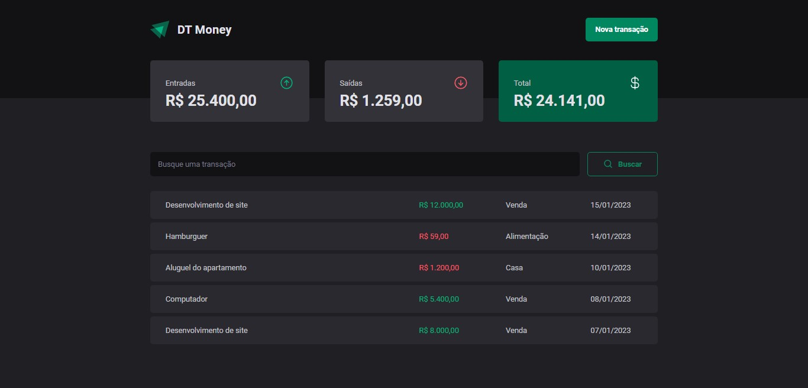

<a name="readme-top"></a>

<!-- PROJECT LOGO -->
<br />
<div align="center">

  <a href="https://github.com/DarkMetaK/DT-Money">
    
  </a>

  <h3 align="center">DT Money</h3>

  <p align="center">
    Desenvolvimento de uma aplicação para controle de entradas/saídas financeiras
  </p>
</div>


<!-- TABLE OF CONTENTS -->
<details>
  <summary>Sumário</summary>
  <ol>
    <li>
      <a href="#sobre">Sobre</a>
      <ul>
        <li><a href="#tecnologias">Tecnologias</a></li>
      </ul>
    </li>
    <li>
      <a href="#como-rodar-o-projeto">Como rodar o projeto</a>
    </li>
    <li><a href="#contato">Contato</a></li>
    <li><a href="#agradecimentos">Agradecimentos</a></li>
  </ol>
</details>


<!-- ABOUT THE PROJECT -->
## Sobre

<a href="https://darkmetak-dtmoney.netlify.app/">
    
</a>

A aplicação se trata de um controle financeiro, sendo possível registrar entradas e saídas monetárias, fornecendo uma descrição e um valor. As transações são ordenadas por ordem de registro, e é possível filtrar a listagem ao pesquisar por um determinado termo. Para o back-end foi utilizado o JSON-Server, que permite a simulação de uma API Restful, e para a hospedagem estática no netlify, foi desenvolvida uma api fake manual que se encontra disponível na branch 'deploy'. A estilização ocorre por meio da ferramenta 'Styled-Components'.

### Tecnologias

[![React][React.js]][React-url]<br>
[![TypeScript][TypeScript.js]][TypeScript-url]<br>

<p align="right">(<a href="#readme-top">Retornar ao topo</a>)</p>

<!-- GETTING STARTED -->
## Como rodar o projeto

É possível acessar a plataforma acessando o link: https://darkmetak-dtmoney.netlify.app/

1 - Clone o repositório
```sh
git clone https://github.com/DarkMetaK/DT-Money.git
```

2 - Instale as dependências
```sh
npm install
```

3 - Execute o JSON-Server
```sh
npm run api
```

4 - Execute a aplicação
```sh
npm run dev
```

<p align="right">(<a href="#readme-top">Retornar ao topo</a>)</p>

<!-- CONTACT -->
## Contato

Matheus Porto - [LinkedIn](https://www.linkedin.com/in/matheusport0/) - matporto03@gmail.com

Link Repositório: [https://github.com/DarkMetaK/DT-Money](https://github.com/DarkMetaK/DT-Money)

<p align="right">(<a href="#readme-top">Retornar ao topo</a>)</p>

<!-- ACKNOWLEDGMENTS -->
## Agradecimentos

* [Best-README-Template](https://github.com/othneildrew/Best-README-Template)
* [Img Shields](https://shields.io)
* [Styled Components](https://styled-components.com/)
* [React Hook Form](https://react-hook-form.com/)
* [React Router](https://reactrouter.com/en/main)
* [JSON-Server](https://github.com/typicode/json-server)

<p align="right">(<a href="#readme-top">Retornar ao topo</a>)</p>

<!-- MARKDOWN LINKS & IMAGES -->
[React.js]: https://img.shields.io/badge/React-20232A?style=for-the-badge&logo=react&logoColor=61DAFB
[React-url]: https://reactjs.org/
[TypeScript.js]: https://shields.io/badge/TypeScript-3178C6?logo=TypeScript&logoColor=FFF&style=for-the-badge
[TypeScript-url]: https://www.typescriptlang.org/
